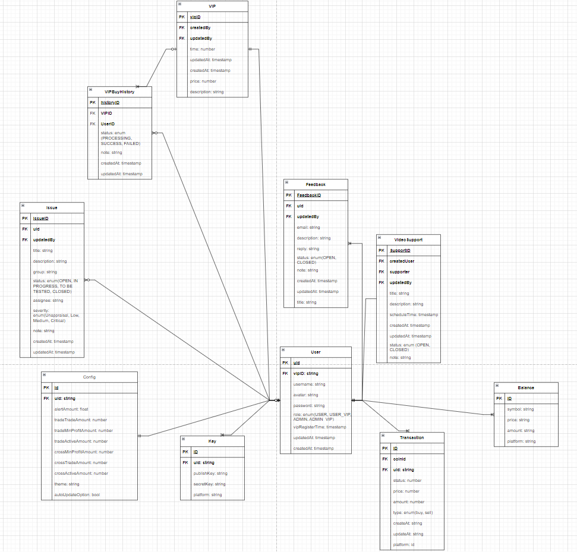
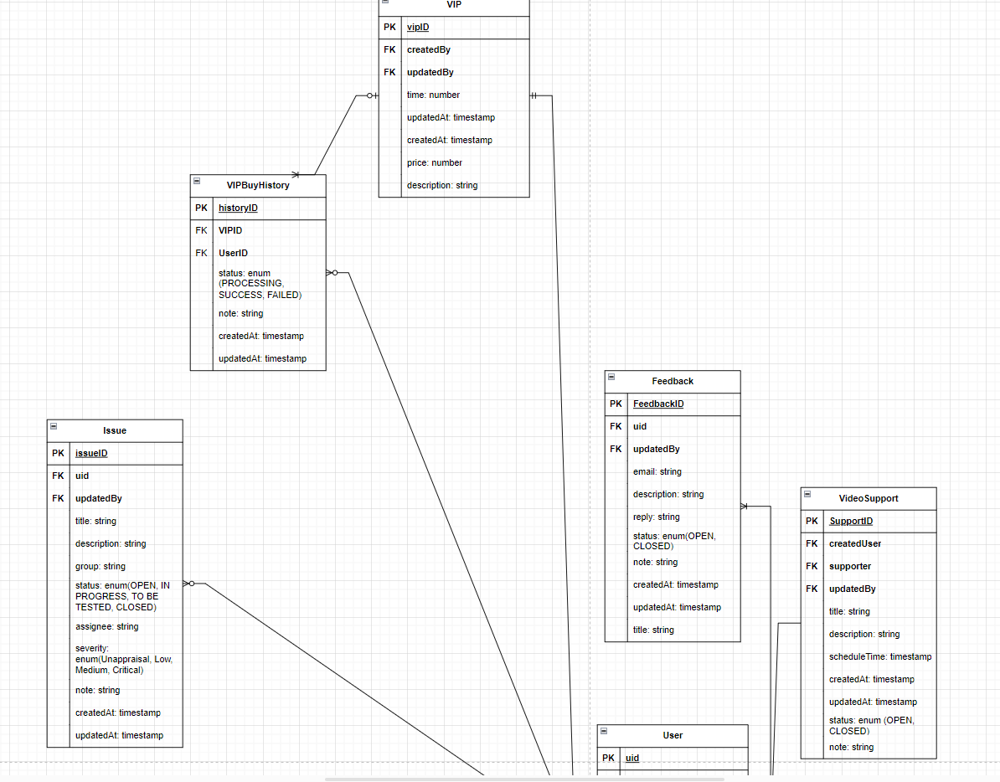
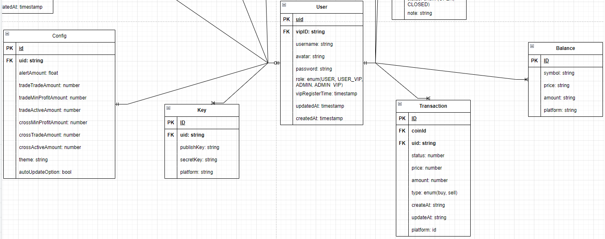

Nodejs 18.14.2

## TODO

---

- [ ] throw error common function
- [ ] module user
  - [ ] login
  - [ ] manage
  - [x] seeder
- [x] auto gen routes - start command
- [x] prettier - eslint
- [ ] setup error handler
- [ ] jwt - auth module
- [ ] middleware
  - [ ] role
  - [x] auth
- [ ] class-validator
- [ ] base
  - [x] entity
  - [ ] dto
  - [ ] response

---

- [x] folder structure
- [x] setup routes
  - [x] swagger
- [x] typeorm - connect sql
  - [x] migration
  - [ ] seeder data [link](https://github.com/bymi15/express-typeorm-rest-boilerplate/blob/main/commands/seed.ts)
  - [ ] transaction
  - [ ] pool connection
- [ ] setup logging
  - [ ] winston
  - [ ] morgan
- [ ] upload file
- [ ] husky

## OPTION

- [ ] docker dev environment
- [ ] build with webpack
- [ ] CLI tool gen code [link](https://github.com/bymi15/express-typeorm-rest-boilerplate/blob/main/commands/lib/Generator.ts)
- [ ] pm2 - ecosystem
- [ ] Setup db aws - production env
  - [ ] learn basic of terraform
  - [ ] setup github actions

